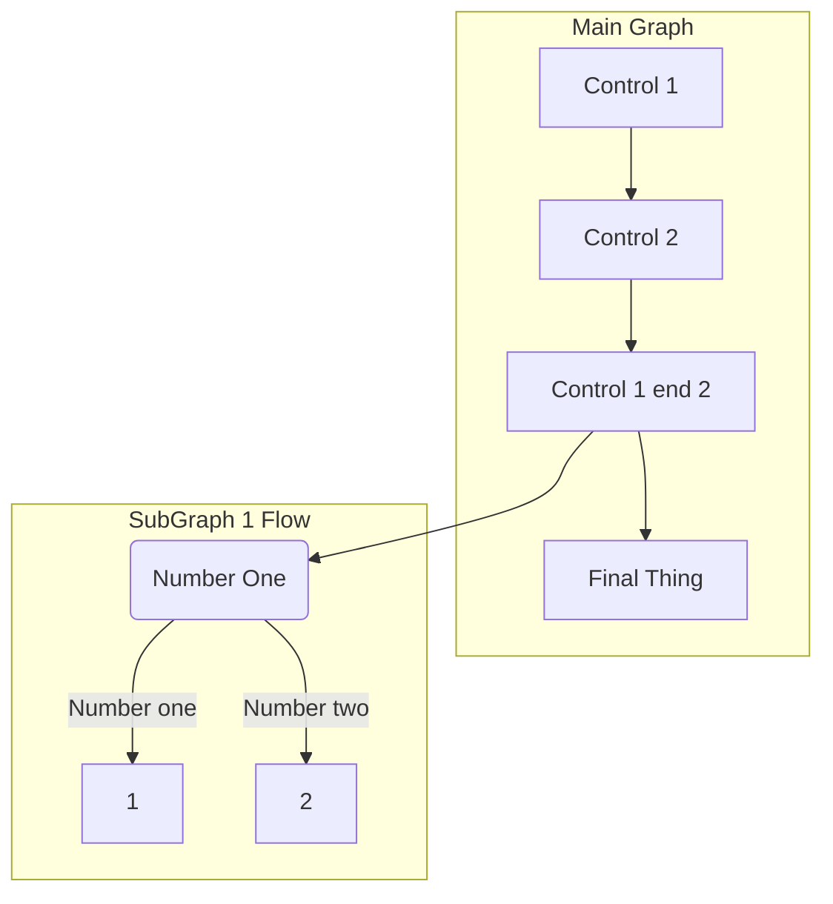

# text
😊 ok 2023
- `#F00`
- `RGB(0%,100%,0%)`

```mermaid
graph TB

  SubGraph1 --> SubGraph1Flow
  subgraph "SubGraph 1 Flow"
  SubGraph1Flow( Number  One)
  SubGraph1Flow -- Number one --> 1
  SubGraph1Flow -- Number two --> 2
  end

  subgraph "Main Graph"
  Node1[Control 1] --> Node2[Control 2]
   --> SubGraph1[Control 1 end 2]
  SubGraph1 --> FinalThing[Final Thing]
end


```
