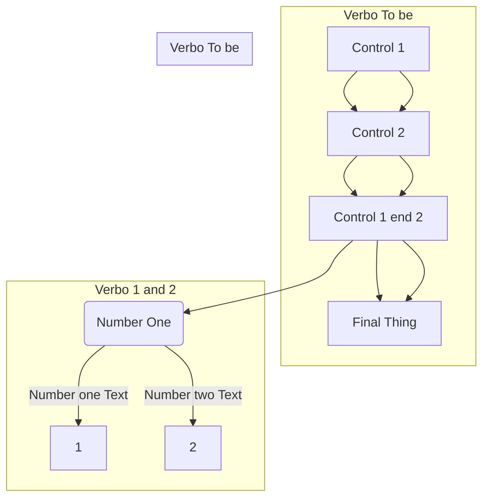

# text
😊 ok 2023
- `#F00`
- `RGB(0%,100%,0%)`

```mermaid
graph TB

  SubGraph1 --> SubGraph1Flow
  subgraph "Verbo 1 and 2"
  SubGraph1Flow( Number  One)
  SubGraph1Flow -- Number one Text--> 1
  SubGraph1Flow -- Number two Text--> 2
  end

  subgraph "Verbo To be"
  Node1[Control 1] --> Node2[Control 2]
   --> SubGraph1[Control 1 end 2]
  SubGraph1 --> FinalThing[Final Thing]
end
  subgraph "Verbo To be"
  Node1[Control 1] --> Node2[Control 2]
   --> SubGraph1[Control 1 end 2]
  SubGraph1 --> FinalThing[Final Thing]
end


```
pie title Pets adopted by volunteers
    "Dogs" : 386
    "Cats" : 85
    "Rats" : 15